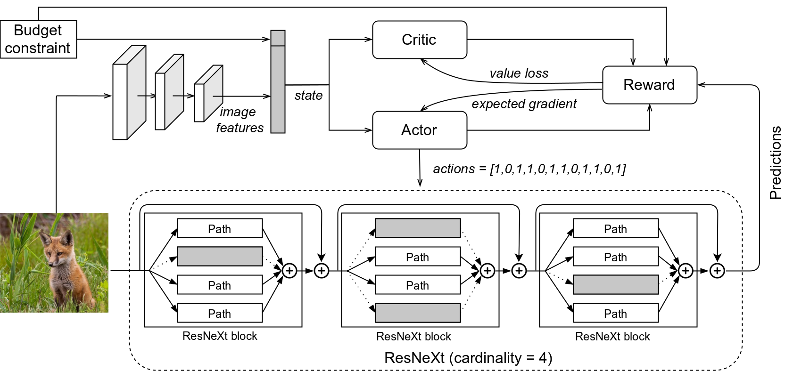
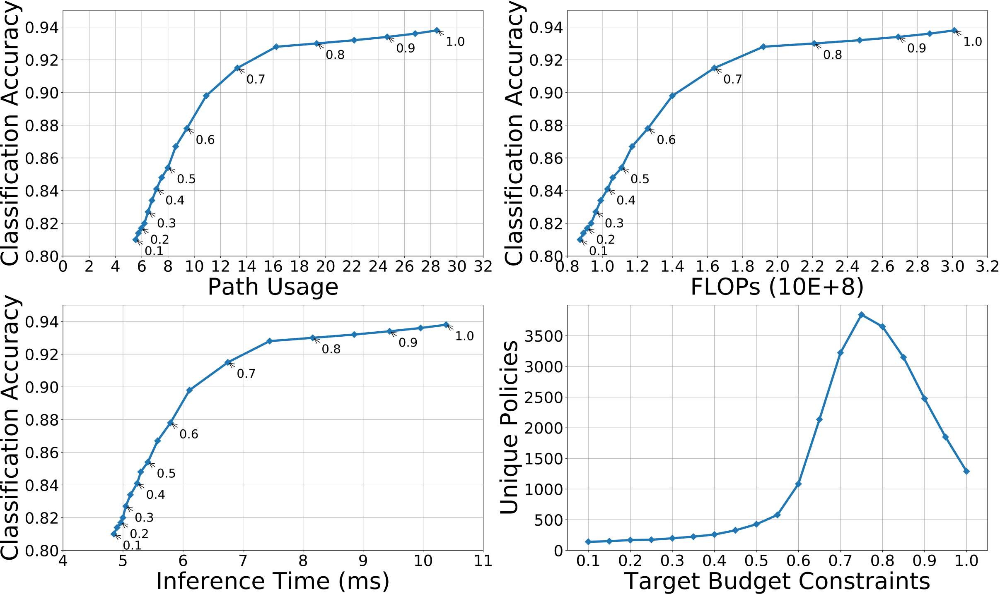

# BudgetNet
## Overall Structure

In this work, we focus on how to dynamically regulate the computational cost of a given model based on target budget constraints during the inference phase. Therefore, we adopt existing CNNs as our pre-trained model rather than design a new network architecture. ResNeXt, a variant of ResNet, exploits a split-transform-merge strategy in building blocks.This strategy introduces a hyper-parameter called cardinality which is the size of the set of transformations, or in other words, the number of independent paths. These independent paths can be considered as a kind of branch structure and is suitable for our requirements. 

## Pre-trained model
[cifar10_ResNext-29_4x16d](https://drive.google.com/file/d/1bhkN900heAVYlFSK4LC-pJ9DyecZ_8Q4/view?usp=sharing
)

*To achieve dynamic path selecting, we implement RexNeXt bottleneck in type A, instead of the grouped convolutions version (type C).

## Results
 

## Reference
https://github.com/Tushar-N/blockdrop

https://github.com/prlz77/ResNeXt.pytorch
